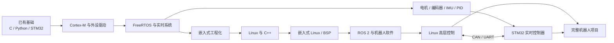

# 嵌入式与机器人学习路线

> 方向：STM32/RTOS + 嵌入式 Linux/BSP + 机器人<br>
> 不包含：云平台、MQTT、智能家居等物联网方向<br>
> 建议投入：每周 12～15 小时<br>
> 建议周期：约 60 周（14～16 个月）<br>
> 更新日期：2026-07-29

## 目录

- [1. 路线目标](#1-路线目标)
- [2. 总体时间表](#2-总体时间表)
- [3. Cortex-M 与 STM32 底层](#3-第一阶段cortex-m-与-stm32-底层)
- [4. FreeRTOS 与实时系统](#4-第二阶段freertos-与实时系统)
- [5. 嵌入式工程化](#5-第三阶段嵌入式工程化)
- [6. Linux 与现代 C++](#6-第四阶段linux-与现代-c)
- [7. 嵌入式 Linux 与 BSP](#7-第五阶段嵌入式-linux-与-bsp)
- [8. 机器人控制基础](#8-第六阶段机器人控制基础)
- [9. ROS 2、ros2_control 与 micro-ROS](#9-第七阶段ros-2ros2_control-与-micro-ros)
- [10. 综合毕业项目](#10-综合毕业项目)
- [11. 每周学习安排](#11-每周学习安排)
- [12. 通用排错方法](#12-通用排错方法)
- [13. 学习记录与项目模板](#13-学习记录与项目模板)
- [14. Python 在路线中的定位](#14-python-在路线中的定位)
- [15. 学习原则](#15-学习原则)
- [16. 阶段性能力检查](#16-阶段性能力检查)
- [17. 文档索引](#17-文档索引)

## 1. 路线目标

### 1.1 这份路线适合谁

这份文档适合已经学习过 C、Python 和 STM32，但还存在以下困惑的人：

- 会使用 CubeMX 配置外设，却说不清生成代码为什么能运行；
- 会调用 HAL 函数，却不会通过参考手册独立配置新外设；
- 项目可以跑起来，但遇到 HardFault、丢数据或偶发死机时不会定位；
- 学过 FreeRTOS 的 API，却不知道任务应该怎样划分；
- 想继续学习嵌入式 Linux 和机器人，却不知道三者之间的先后关系；
- 看过很多视频，但还没有一套能够展示和复现的完整项目。

如果你暂时只能完成点灯、串口打印等基础实验，也可以从第一阶段开始。遇到已经掌握的内容，不要直接跳过：先完成对应的验收题，确认自己能独立完成后再前进。

### 1.2 最终要形成的能力

这条路线的最终目标不是单独学会几项技术，而是具备开发完整机器人嵌入式系统的能力：

- STM32/FreeRTOS 负责电机、编码器、IMU、实时控制和安全保护；
- 嵌入式 Linux 负责设备管理、上层程序、调试、日志和系统集成；
- ROS 2 负责机器人组件通信、硬件抽象、可视化和高层控制；
- Python 用于测试工具、串口工具、数据分析和自动化；
- C/C++ 用于固件、Linux 系统程序、ROS 2 节点和驱动。



简单理解：

- **STM32 是“反应快的手脚”**：按固定周期读取传感器、控制电机，即使 Linux 卡顿也要保证安全；
- **嵌入式 Linux 是“资源丰富的身体”**：运行较大的程序，管理文件、网络、日志和多个进程；
- **ROS 2 是“机器人软件的连接框架”**：让控制、传感器、定位和可视化模块使用统一方式通信；
- **Python 是“测试和分析工具”**：帮助模拟设备、发送命令、绘制曲线和自动验证功能。

### 1.3 怎样使用这份文档

不要从头到尾只阅读一遍。每个阶段都按照下面的循环执行：

1. **先看目标**：弄清楚这阶段要解决什么实际问题；
2. **做最小实验**：一次只验证一个知识点，例如先让 DMA 接收工作；
3. **集成进阶段项目**：把孤立实验整理成可复用模块；
4. **主动制造故障**：例如拔掉传感器、发错误数据、降低任务栈；
5. **完成验收清单**：尽量不看教程，独立重新实现；
6. **整理文档和 Git 提交**：记录设计理由、错误现象和解决过程。

学习时遵循“三遍法”：

- 第一遍跟着官方示例运行，知道它能做什么；
- 第二遍关掉示例，凭理解重新实现；
- 第三遍改变条件或增加故障，确认自己真的掌握。

如果今天就开始，可以先做三件事：

1. 建立一个新的 Git 仓库，并写下自己的 STM32 型号和现有器材；
2. 不看旧工程，重新完成 GPIO、UART 和定时器中断；
3. 建立 `notes/week-01.md`，使用本文的每周复盘模板记录过程。

### 1.4 开始前的基础自测

先尝试独立完成以下任务。不会的项目就是第一阶段需要重点补齐的内容：

- [ ] 使用 C 编写环形缓冲区，并处理缓冲区满和空；
- [ ] 解释指针、数组、结构体和函数指针的常见用法；
- [ ] 使用 STM32 完成 GPIO、UART、定时器中断；
- [ ] 看懂芯片原理图中的电源、时钟、复位和调试接口；
- [ ] 使用断点、单步和变量观察定位简单错误；
- [ ] 使用 Python 打开串口、收发数据并保存文件；
- [ ] 使用 Git 创建仓库、提交修改并查看历史。

自测不要求全部通过。它的作用是确定起点，不是考试。

### 1.5 软硬件准备

前期尽量使用你已有的 STM32 开发板，不要为了“路线完整”一次购买所有设备。

**第一至第三阶段需要：**

- 一块带调试接口的 STM32 开发板；
- ST-Link 或开发板自带调试器；
- USB 转串口模块；
- 面包板、杜邦线、LED、按键和常用电阻；
- 一个常见 I²C 或 SPI 传感器；
- 入门级逻辑分析仪；
- 条件允许时准备示波器。

**Linux 和机器人阶段再准备：**

- 一块能够运行 Linux 的 ARM 开发板；
- 两个带编码器的低压直流减速电机；
- 与电机电流匹配的驱动板；
- 一个 IMU；
- 独立、限流的电机电源；
- 保险丝、急停或方便断电的开关；
- 机械底盘和固定件。

**常用软件：**

- STM32CubeIDE、STM32CubeProgrammer；
- Git、CMake、Python 虚拟环境；
- GDB、OpenOCD；
- VS Code 或其他熟悉的编辑器；
- Ubuntu 实机、虚拟机或 WSL2，用于 Linux 与 ROS 2 学习。

> 安全提醒：电机不要直接由开发板引脚供电；接线时先断电；首次调试让轮子悬空；使用限流电源；确认电机电源与逻辑电源的地线连接方式。

### 1.6 常用术语速查

| 术语 | 通俗解释 |
|---|---|
| MCU | 微控制器。STM32 就是一类 MCU，适合直接控制硬件 |
| Cortex-M | STM32 常用的 Arm 处理器内核系列 |
| HAL | 厂商提供的硬件抽象库，用统一函数封装寄存器操作 |
| BSP | 板级支持包，负责让操作系统或应用适配某块硬件 |
| Driver | 驱动程序，把具体硬件能力包装成可调用接口 |
| ISR | 中断服务函数，硬件事件发生时由 CPU 立即执行的代码 |
| DMA | 不让 CPU 逐字节搬运数据，由硬件自动完成内存传输 |
| RTOS | 实时操作系统，强调任务在规定时间内得到响应 |
| Task/Thread | 可以独立调度的一段执行流程 |
| Bootloader | 上电后先运行的小程序，负责检查、升级或启动正式固件 |
| 交叉编译 | 在 PC 上编译出供 ARM 开发板运行的程序 |
| Device Tree | Linux 中描述板上硬件连接关系的数据文件 |
| RootFS | Linux 根文件系统，包含程序、配置和库 |
| ROS 2 | 机器人软件通信和组件组织框架，不是普通意义上的操作系统 |
| QoS | 通信质量策略，例如是否允许丢消息、是否保存历史数据 |
| PID | 根据目标值与实际值的误差不断修正控制输出的算法 |
| 里程计 | 根据轮子或其他传感器推算机器人移动距离和姿态 |

## 2. 总体时间表

| 阶段 | 周数 | 核心内容 | 阶段项目 |
|---|---:|---|---|
| Cortex-M 与 STM32 底层 | 1～6 | 启动、中断、内存、外设、DMA、CAN | 多传感器采集器 |
| FreeRTOS 与实时系统 | 7～14 | 任务、IPC、调度、竞态、故障恢复 | 机器人底盘控制器 |
| 嵌入式工程化 | 15～19 | Git、构建、调试、测试、Bootloader | 可升级固件平台 |
| Linux 与现代 C++ | 20～27 | 进程、线程、Socket、串口、CMake | Linux 通信服务 |
| 嵌入式 Linux/BSP | 28～37 | 交叉编译、Buildroot、设备树、驱动 | 自定义 Linux 镜像 |
| 机器人控制基础 | 38～45 | 电机、编码器、IMU、PID、运动学 | 差速底盘 |
| ROS 2 与 micro-ROS | 46～52 | ROS 2、TF2、URDF、ros2_control | ROS 2 硬件接口 |
| 综合毕业项目 | 53～60 | STM32 + Linux + ROS 2 集成 | 完整差速机器人 |

如果每周只能投入 6～8 小时，可以将每个阶段的时间增加约 50%；不要通过跳过项目来压缩周期。

### 2.1 阶段之间为什么这样排列

- 先学 STM32 底层，是为了知道硬件、中断和内存真正如何工作；
- 再学 FreeRTOS，是因为多任务问题建立在中断、定时器和内存基础之上；
- 工程化放在 Linux 前，是为了尽早形成调试、测试和版本管理习惯；
- 先学 Linux 应用，再学 BSP 和驱动，避免一开始被内核细节淹没；
- 先实现稳定底盘控制，再学 ROS 2，保证机器人不是“只能在仿真里运行”；
- micro-ROS 放在最后，因为它同时要求理解 RTOS、ROS 2 和通信。

### 2.2 可以跳级吗

可以，但必须通过上一阶段的验收清单。建议遵循以下规则：

- 已经会 HAL，不代表可以跳过 Cortex-M、中断和 DMA；
- 已经用过 FreeRTOS，不代表理解竞态、优先级反转和栈水位；
- 会使用 Ubuntu，不代表掌握 Linux 系统编程；
- 会启动 ROS 2 示例，不代表能编写硬件接口；
- 项目“运行过一次”不等于通过验收，至少还要测试错误路径。

---

## 3. 第一阶段：Cortex-M 与 STM32 底层

### 3.1 这一阶段要解决什么问题

很多初学者会使用 `HAL_UART_Transmit()`，但不知道数据为什么会从引脚发出去；程序死机后，也只能尝试重新生成代码。这一阶段要把 STM32 从“黑盒”变成可以理解和调试的系统。

你不需要完全放弃 HAL。正确做法是：

- 用 HAL 快速完成初始化；
- 对照参考手册理解 HAL 修改了哪些寄存器；
- 在关键模块中尝试 LL 或直接访问寄存器；
- 最终能够根据手册独立配置一个没有学过的外设。

### 3.2 学习内容

- Cortex-M 内核与 CMSIS；
- 上电复位、启动文件、向量表和 `SystemInit()`；
- Flash、SRAM、栈、堆和内存映射；
- ELF、链接脚本、段、符号和 map 文件；
- NVIC、中断优先级、SysTick、PendSV；
- GPIO、EXTI、UART、定时器、PWM、ADC；
- I²C、SPI、DMA、CAN；
- `volatile`、内存对齐、位操作、临界区；
- HAL、LL 和寄存器开发之间的关系；
- HardFault 寄存器、调用栈和故障定位。

### 3.3 六周执行安排

| 周次 | 重点 | 当周必须完成的实验 |
|---|---|---|
| 第 1 周 | 启动、时钟和 GPIO | 跟踪复位到 `main()`；不用延时库实现 LED 闪烁 |
| 第 2 周 | 中断、定时器和 UART | 按键中断控制状态；定时器产生固定周期；UART 输出日志 |
| 第 3 周 | I²C、SPI 和传感器 | 读取一个传感器；拔掉传感器后程序不能永久卡死 |
| 第 4 周 | DMA 和环形缓冲区 | DMA 接收串口数据；正确处理半包、粘包和缓冲区满 |
| 第 5 周 | ADC、PWM、CAN | PWM 控制输出；ADC 采样；有 CAN 硬件时完成基础收发 |
| 第 6 周 | 故障与项目整理 | 制造 HardFault；根据现场定位；完成采集器和项目文档 |

每周只增加一到两个新外设。一次同时调试时钟、DMA、中断和协议，出现问题后很难判断故障来自哪里。

### 3.4 阶段项目：多传感器采集器

建议功能：

- 使用 I²C 或 SPI 读取至少一个传感器；
- 使用定时器产生固定采样周期；
- UART 使用 DMA 和环形缓冲区；
- 使用 Python 编写串口接收和数据绘图工具；
- 驱动接口具备错误码、超时和重试；
- 使用逻辑分析仪验证通信时序；
- 输出固件的 Flash、RAM 使用情况。

### 3.5 验收标准

- [ ] 可以解释 MCU 从复位到 `main()` 的过程；
- [ ] 可以说明栈、堆、`.data`、`.bss` 和 `.text` 的位置；
- [ ] 可以根据参考手册配置一个未学过的简单外设；
- [ ] 可以用 DMA 和环形缓冲区接收不定长数据；
- [ ] 可以通过 HardFault 现场和 map 文件定位错误；
- [ ] 可以解释 HAL、LL、CMSIS 和寄存器之间的关系。

### 3.6 四类芯片文档分别怎么看

| 文档 | 主要回答的问题 | 常见使用场景 |
|---|---|---|
| Datasheet | 芯片有哪些引脚、电气限制和外设资源 | 查引脚复用、电压、电流、封装 |
| Reference Manual | 外设怎样工作、寄存器怎样配置 | 查 UART、DMA、定时器、ADC |
| Programming Manual | Cortex-M 内核和系统寄存器怎样工作 | 查 NVIC、异常、MPU、指令 |
| Errata Sheet | 芯片已知有哪些硬件问题 | 遇到无法解释的边界问题时核对 |

阅读外设章节时，不要从第一页逐字翻译。先回答五个问题：

1. 外设的输入时钟来自哪里？
2. 使用哪些引脚和复用功能？
3. 启用外设需要哪些关键寄存器或 HAL 配置？
4. 完成、错误和超时通过什么标志判断？
5. 中断或 DMA 的数据流怎样走？

### 3.7 常见误区

- **误区：寄存器开发才是真正的嵌入式。** 产品开发可以使用 HAL；关键是理解其行为和代价。
- **误区：串口打印正常就说明实时性正常。** 阻塞式打印可能改变时序，甚至掩盖竞态问题。
- **误区：中断越多越实时。** 中断过长会阻塞其他工作；ISR 应尽量短。
- **误区：DMA 完全不需要 CPU。** CPU 仍需配置 DMA、处理完成事件和缓冲区所有权。
- **误区：程序跑起来就结束。** 还要测试传感器断开、数据错误、缓冲区满等异常情况。

### 3.8 学习文档

- [STM32 MCU Developer Zone](https://www.st.com/content/st_com/en/stm32-mcu-developer-zone.html)
- [STM32 官方免费 MOOC](https://www.st.com/content/st_com/en/support/learning/stm32-moocs.html)
- [STM32CubeIDE 快速入门手册（PDF）](https://www.st.com/resource/en/user_manual/um2553-stm32cubeide-quick-start-guide-stmicroelectronics.pdf)
- [Arm CMSIS-Core 文档](https://arm-software.github.io/CMSIS_6/latest/Core/index.html)
- [STM32CubeProgrammer](https://www.st.com/content/st_com/en/stm32cubeprogrammer.html)
- [STM32CubeMonitor](https://www.st.com/en/development-tools/stm32cubemonitor.html)

此外，需要长期保存并反复阅读自己芯片对应的四类资料：

1. Datasheet；
2. Reference Manual；
3. Programming Manual；
4. Errata Sheet。

---

## 4. 第二阶段：FreeRTOS 与实时系统

### 4.1 这一阶段要解决什么问题

裸机程序常见写法是一个不断增长的 `while (1)`。功能少时还能维护，加入电机、IMU、通信和存储后，不同模块会互相阻塞。FreeRTOS 的作用不是让程序“看起来更高级”，而是让多个有不同时间要求的工作得到清晰调度。

“实时”也不等于“速度最快”，而是重要任务能在可预测的时间内完成。例如电机控制可以规定每 1 ms 执行一次，而日志晚几十毫秒通常没有关系。

### 4.2 学习内容

- 任务状态、上下文切换和抢占式调度；
- 任务优先级、时间片和阻塞等待；
- 队列、任务通知、信号量和互斥锁；
- 事件组、软件定时器；
- ISR 安全 API；
- 优先级反转与优先级继承；
- 竞态条件、死锁和临界区；
- 静态与动态内存分配；
- 栈水位、CPU 占用和运行时间统计；
- 看门狗、任务心跳和故障恢复；
- 实时系统中的超时和降级策略。

### 4.3 八周执行安排

| 周次 | 重点 | 当周必须完成的实验 |
|---|---|---|
| 第 7 周 | 任务与调度 | 创建不同周期的任务，观察阻塞、延时和优先级 |
| 第 8 周 | 队列与任务通知 | ISR 产生数据，任务通过通知或队列处理 |
| 第 9 周 | 信号量与互斥锁 | 共享串口或总线；人为制造并修复竞态 |
| 第 10 周 | 事件组与软件定时器 | 管理系统就绪状态、超时和低频工作 |
| 第 11 周 | 内存和任务栈 | 比较静态/动态创建；测量任务栈水位 |
| 第 12 周 | 调度异常 | 制造死锁、优先级反转和任务饿死并记录现象 |
| 第 13 周 | 底盘任务架构 | 集成电机、编码器、IMU、通信和诊断任务 |
| 第 14 周 | 故障注入与验收 | 断开通信、阻塞任务、填满队列，验证安全行为 |

任务划分不是“一个函数对应一个任务”。只有执行周期、优先级或阻塞行为明显不同的工作，才考虑拆成独立任务。

### 4.4 阶段项目：FreeRTOS 机器人底盘控制器

建议任务：

```text
MotorControlTask
EncoderTask
ImuTask
CommunicationTask
ParameterStorageTask
DiagnosticsTask
```

设计要求：

- 电机控制使用固定周期；
- 中断只采集必要数据；
- 任务间优先使用消息传递；
- 通信超时后自动停止电机；
- 看门狗能够识别关键任务卡死；
- 记录每个任务的栈水位和执行时间；
- 参数保存过程不能阻塞实时控制任务。

### 4.5 验收标准

- [ ] 可以画出所有任务和通信关系；
- [ ] 可以解释队列、任务通知、信号量和互斥锁的区别；
- [ ] 可以解释优先级反转并给出解决方法；
- [ ] 可以发现并修复一次人为制造的竞态条件；
- [ ] 可以检测任务栈溢出和任务卡死；
- [ ] 控制周期不会被 Flash 写入或串口输出长时间阻塞。

### 4.6 常见误区

- **所有模块都建一个任务。** 任务过多会增加栈内存、调度和通信复杂度。
- **用高优先级解决所有延迟。** 每个任务都提高优先级，最终等于没有优先级设计。
- **循环查询共享全局变量。** 优先使用队列、通知或事件表达数据与状态变化。
- **在临界区中做耗时操作。** 临界区只保护最短的共享状态更新。
- **只测试正常运行。** RTOS 问题通常是偶发问题，要主动制造队列满、任务超时和资源竞争。

### 4.7 学习文档

- [FreeRTOS 初学者指南](https://freertos.org/Documentation/01-FreeRTOS-quick-start/01-Beginners-guide/00-Overview)
- [FreeRTOS 官方文档首页](https://docs.freertos.org/)
- [STM32 FreeRTOS 官方 MOOC](https://www.st.com/content/st_com/en/support/learning/stm32-moocs/FreeRTOS_on_STM32_MOOC.html)
- [STM32Cube 中的 RTOS 应用开发手册（PDF）](https://www.st.com/resource/en/user_manual/um1722-developing-applications-on-stm32cube-with-rtos-stmicroelectronics.pdf)

学习顺序建议：先掌握原生 FreeRTOS 概念，再理解 CMSIS-RTOS 封装。不要只会使用 CubeMX 生成的任务模板。

---

## 5. 第三阶段：嵌入式工程化

### 5.1 这一阶段要解决什么问题

“能运行的示例”和“能维护的工程”差别很大。真正的嵌入式项目需要可重复构建、可调试、可测试、可升级，而且出现故障后要留下线索。这一阶段会把前面的代码整理成工程，而不是继续堆功能。

### 5.2 学习内容

- Git 提交、分支、标签和版本发布；
- GCC 编译、汇编、链接流程；
- Make 和 CMake；
- GDB、OpenOCD、ST-Link；
- 编译器警告和静态分析；
- 主机端单元测试；
- 日志分级、断言、错误码；
- 故障现场和复位原因记录；
- Bootloader、固件格式、CRC；
- 参数掉电保存和 Flash 磨损；
- Python 自动化测试和日志分析。

### 5.3 五周执行安排

| 周次 | 重点 | 当周必须完成的成果 |
|---|---|---|
| 第 15 周 | Git 与构建过程 | 整理仓库；理解预处理、编译、汇编、链接 |
| 第 16 周 | GDB 与故障定位 | 练习断点、观察点、反汇编、调用栈和 map 文件 |
| 第 17 周 | 测试与 Python 工具 | 在 PC 测试协议、CRC、状态机；Python 模拟设备 |
| 第 18 周 | Bootloader | 定义固件格式，实现校验和应用跳转 |
| 第 19 周 | 发布与故障恢复 | 制造升级中断；完成版本、日志、复位原因和文档 |

### 5.4 推荐工程结构

```text
robot-firmware/
├── app/
├── bsp/
├── drivers/
├── components/
├── middleware/
├── bootloader/
├── tests/
├── tools/
├── docs/
├── CMakeLists.txt
└── README.md
```

### 5.5 阶段项目：可升级固件平台

要求：

- Bootloader 与 Application 分离；
- 固件包含版本、长度和校验信息；
- 升级失败后不会直接运行损坏固件；
- 保存复位原因和最近一次错误；
- Python 工具能够打包和发送固件；
- 主机端能够测试协议解析、CRC 和状态机。

### 5.6 验收标准

- [ ] 可以解释从源文件到 ELF/HEX/BIN 的过程；
- [ ] 可以在命令行完成编译和调试；
- [ ] 可以使用断点、条件断点、观察点和调用栈；
- [ ] 可以使用 Python 自动执行至少一组固件测试；
- [ ] 项目有 README、架构图、协议和测试说明；
- [ ] 可以执行一次失败升级并安全恢复。

### 5.7 常见误区

- **只在 IDE 里点击 Build。** 至少要理解编译器、链接器、ELF 和二进制文件的关系。
- **只有硬件接上才能测试。** 协议、算法和状态机应尽量在 PC 上运行单元测试。
- **日志越多越好。** 日志要有级别、时间和模块，实时路径中避免阻塞输出。
- **Bootloader 只要能跳转即可。** 还要验证长度、地址、校验、版本和升级失败场景。
- **Git 只是云端备份。** 每次提交应表达一个清晰改动，并能根据历史恢复和定位问题。

### 5.8 学习文档

- [Git 官方参考书](https://git-scm.com/book/en/v2)
- [CMake 官方教程](https://cmake.org/cmake/help/latest/guide/tutorial/)
- [GDB 官方文档](https://sourceware.org/gdb/current/onlinedocs/gdb)
- [GDB 远程调试](https://sourceware.org/gdb/current/onlinedocs/gdb.html/Remote-Debugging.html)
- [OpenOCD 用户手册](https://openocd.org/doc/html/index.html)

---

## 6. 第四阶段：Linux 与现代 C++

### 6.1 这一阶段要解决什么问题

STM32 上的程序通常直接控制硬件，没有进程和完整文件系统。Linux 则同时运行许多程序，硬件通过统一接口暴露给用户空间。你需要先学会编写可靠的 Linux 应用，之后才能真正理解驱动、BSP 和 ROS 2 在系统中的位置。

C++ 也不需要一次学完。机器人 Linux 端优先掌握对象生命周期、资源管理、并发和模块接口，这些知识比复杂模板技巧更重要。

### 6.2 学习内容

- Linux 命令、目录、权限和进程；
- Shell 基础和自动化脚本；
- GCC/G++、Make、CMake、Git；
- C++11/17：类、RAII、智能指针、STL；
- 多进程、多线程、互斥锁和条件变量；
- 管道、共享内存和消息队列；
- 串口、Socket、`select`/`poll`/`epoll`；
- 信号、定时器和守护进程；
- GDB、gdbserver、strace；
- Python 与 C++ 程序协作；
- 基础数据结构和状态机。

不必一开始学习复杂模板元编程。优先掌握资源管理、对象生命周期、并发和错误处理。

### 6.3 八周执行安排

| 周次 | 重点 | 当周必须完成的实验 |
|---|---|---|
| 第 20 周 | Linux 基础 | 文件、权限、进程、日志和 Shell 脚本 |
| 第 21 周 | GCC、Make、CMake | 命令行构建多文件 C/C++ 项目 |
| 第 22 周 | C++ 对象与 RAII | 封装文件、串口或线程资源 |
| 第 23 周 | STL 与错误处理 | 使用容器、字符串、枚举错误或异常边界 |
| 第 24 周 | 进程和线程 | 比较进程与线程；完成生产者—消费者实验 |
| 第 25 周 | IPC 与串口 | 管道、共享内存；完成串口协议收发 |
| 第 26 周 | Socket 与事件循环 | 编写 TCP/UDP 示例；理解 `poll` 或 `epoll` |
| 第 27 周 | 通信服务集成 | Python 模拟 STM32；验证重连、超时和错误数据 |

### 6.4 阶段项目：Linux 机器人通信服务

功能要求：

- 通过 UART 或 CAN 与 STM32 通信；
- 解析传感器、编码器和诊断数据；
- 发送速度和控制命令；
- 记录带时间戳的日志；
- 支持断线检测、重连和协议错误统计；
- 使用配置文件设置端口和波特率；
- 可以使用模拟 STM32 的 Python 程序进行测试。

### 6.5 验收标准

- [ ] 可以编写并调试多线程 C++ 程序；
- [ ] 可以解释 RAII 如何避免资源泄漏；
- [ ] 可以处理串口粘包、拆包和校验错误；
- [ ] 可以通过 gdbserver 远程调试目标程序；
- [ ] 可以用 Python 模拟设备并完成自动测试；
- [ ] 程序退出和异常路径不会泄漏文件描述符或线程。

### 6.6 常见误区

- **先背大量 Linux 命令。** 命令应围绕编译、调试、日志和设备访问来学。
- **把 C++ 当作“带类的 C”。** 核心是对象生命周期、接口边界和资源所有权。
- **一出现并发问题就加锁。** 先减少共享状态，再设计线程间消息传递。
- **串口一次 `read()` 就得到完整数据帧。** 实际读取可能只有半帧，也可能包含多帧。
- **只处理成功返回值。** 系统调用必须处理超时、中断、断开和部分读写。

### 6.7 学习文档

- [Ubuntu：Linux 命令行入门](https://documentation.ubuntu.com/desktop/en/latest/tutorial/the-linux-command-line-for-beginners/)
- [Linux man-pages 项目](https://www.kernel.org/doc/man-pages/)
- [C++ 核心语言参考](https://en.cppreference.com/w/cpp/language)
- [C++ RAII 说明](https://en.cppreference.com/w/cpp/language/raii)
- [C++ 并发支持库](https://en.cppreference.com/w/cpp/thread)
- [CMake 官方教程](https://cmake.org/cmake/help/latest/guide/tutorial/)

---

## 7. 第五阶段：嵌入式 Linux 与 BSP

### 7.1 这一阶段要解决什么问题

普通 Linux 应用运行在别人已经配置好的系统上；嵌入式 Linux 工程师还要负责让系统在目标板上启动，并正确识别板上的串口、I²C、SPI、GPIO 等硬件。

可以把系统理解为四块：

```text
Bootloader  →  Linux Kernel + Device Tree  →  RootFS  →  你的应用
负责启动       负责内核和硬件描述              提供文件和库   实现产品功能
```

### 7.2 学习顺序

1. ARM 交叉编译；
2. Bootloader、Kernel、Root Filesystem 的关系；
3. 使用 Buildroot 构建最小系统；
4. Linux Device Tree；
5. 字符设备和 platform driver；
6. I²C、SPI、GPIO 驱动模型；
7. 内核模块、sysfs、udev；
8. 系统启动服务和日志；
9. 最后再学习 Yocto。

### 7.3 十周执行安排

| 周次 | 重点 | 当周必须完成的成果 |
|---|---|---|
| 第 28 周 | 交叉编译 | 在 PC 编译 ARM 程序并在开发板运行 |
| 第 29 周 | Buildroot | 构建最小系统，保存可复现配置 |
| 第 30 周 | 启动流程 | 阅读串口启动日志，标出 Bootloader、Kernel、RootFS 阶段 |
| 第 31 周 | Device Tree | 修改一个节点或引脚配置并验证变化 |
| 第 32 周 | 字符设备 | 编写最小内核模块，理解设备号和文件操作接口 |
| 第 33 周 | platform/I²C/SPI | 理解 `probe()`、匹配和资源获取 |
| 第 34 周 | 应用集成 | 将自己的 C++ 服务加入系统镜像 |
| 第 35 周 | 远程调试 | 使用 gdbserver、日志和 `dmesg` 定位问题 |
| 第 36 周 | Yocto 概览 | 理解 layer、recipe、BitBake；暂不追求复杂定制 |
| 第 37 周 | 系统验收 | 从干净环境重建镜像，并记录完整步骤 |

### 7.4 阶段项目：自定义嵌入式 Linux 镜像

要求：

- 构建可启动的最小 Linux 镜像；
- 集成自己的 C++ 通信服务；
- 添加启动脚本或 systemd 服务；
- 修改设备树启用一个硬件接口；
- 编写一个简单字符设备或 platform driver；
- 通过串口或网络远程调试；
- 保存可复现的 Buildroot 配置。

### 7.5 验收标准

- [ ] 可以解释 Bootloader、Kernel、DTB 和 RootFS 的加载关系；
- [ ] 可以交叉编译并运行 C/C++ 程序；
- [ ] 可以修改设备树启用或禁用外设；
- [ ] 可以构建并加载外部内核模块；
- [ ] 可以将自己的程序加入 Buildroot；
- [ ] 可以分析一次内核启动或驱动 probe 失败。

### 7.6 常见误区

- **直接修改 RootFS 输出目录。** 重新构建后会丢失；应使用 Buildroot overlay、package 或正式配置机制。
- **设备树等同于驱动。** 设备树描述硬件，驱动实现操作硬件的代码。
- **模块能加载就算驱动完成。** 还要检查资源释放、并发、错误路径和卸载。
- **一开始就学 Yocto 的所有概念。** 先用 Buildroot理解完整系统，再进入复杂构建体系。
- **忽略启动日志。** 串口启动日志是分析内核、设备树和驱动问题的首要证据。

### 7.7 学习文档

- [U-Boot 官方文档](https://docs.u-boot.org/en/latest/)
- [Buildroot 用户手册](https://buildroot.org/downloads/manual/manual.html)
- [Yocto Project 文档](https://docs.yoctoproject.org/current/)
- [Yocto Overview and Concepts](https://docs.yoctoproject.org/current/overview-manual/intro.html)
- [Linux Kernel 文档](https://docs.kernel.org/)
- [Linux 与 Device Tree](https://docs.kernel.org/devicetree/usage-model.html)
- [构建外部内核模块](https://docs.kernel.org/kbuild/modules.html)

Buildroot 更适合第一次理解完整系统；Yocto 更适合后期学习复杂、可维护的产品构建体系。

---

## 8. 第六阶段：机器人控制基础

### 8.1 这一阶段要解决什么问题

机器人不是“让电机转起来”就完成了。开环 PWM 会受电池电压、负载和摩擦影响，同样的占空比不一定得到同样的速度。编码器提供实际速度，PID 根据误差调整输出，才能形成闭环控制。

这一阶段先做好低层运动控制，不急着进入 SLAM 或导航。没有稳定底盘，越上层的软件越难调试。

### 8.2 数学与控制

- 向量、矩阵和坐标系；
- 角度、弧度和旋转；
- 速度、加速度和采样周期；
- PID 与抗积分饱和；
- 一阶低通和互补滤波；
- 编码器计数、测速和里程；
- IMU 零偏、噪声和姿态基础；
- 差速底盘运动学；
- 里程计推算；
- 状态机和轨迹插值。

不需要先完成整本高等数学。围绕项目按需掌握：

- 看懂直角坐标系和角度正负方向；
- 能使用基本矩阵表示坐标变换；
- 能根据轮径、编码器线数和减速比计算速度；
- 理解采样周期改变会影响控制器；
- 能读懂速度曲线并判断超调、振荡和稳态误差。

### 8.3 八周执行安排

| 周次 | 重点 | 当周必须完成的实验 |
|---|---|---|
| 第 38 周 | 电机和安全 | PWM 调速、方向控制、限流和急停 |
| 第 39 周 | 编码器 | 正确读取方向和计数，计算转速 |
| 第 40 周 | 单电机 PID | 记录目标与实际速度曲线并调参 |
| 第 41 周 | 双电机控制 | 左右轮闭环，统一单位、方向和饱和限制 |
| 第 42 周 | 差速运动学 | 将线速度/角速度转换为左右轮速度 |
| 第 43 周 | IMU | 校准零偏，观察静止噪声和运动数据 |
| 第 44 周 | 里程计 | 根据编码器推算位置和朝向 |
| 第 45 周 | 底盘集成 | 完成安全停车、诊断和 Linux 通信 |

### 8.4 实践顺序

1. PWM 控制一个直流电机；
2. 编码器测速；
3. 一个电机闭环调速；
4. 两个电机同步控制；
5. 差速底盘速度控制；
6. 计算里程计；
7. 读取和校准 IMU；
8. STM32 与 Linux 主控通信。

### 8.5 阶段项目：差速机器人底盘

STM32 负责：

- 固定周期电机控制；
- 编码器采集；
- PID；
- IMU 采集；
- 里程计基础数据；
- 命令超时停车；
- 看门狗和故障保护；
- 与 Linux 主控通信。

### 8.6 验收标准

- [ ] 电机能够稳定跟踪目标速度；
- [ ] 左右轮速度单位和方向定义一致；
- [ ] 控制周期可以测量并记录；
- [ ] 机器人可以完成直行、旋转和停止；
- [ ] 通信中断后能够安全停车；
- [ ] 里程计数据能够发送给 Linux；
- [ ] 能解释 PID 参数变化对系统的影响。

### 8.7 常见误区

- **车轮悬空时调好 PID 就结束。** 落地负载不同，需要重新验证。
- **只看“能不能跟上”，不记录曲线。** 调参必须同时记录目标值、实际值和控制输出。
- **单位混乱。** 统一使用秒、米、弧度等单位，并在协议中明确。
- **忽略方向约定。** 左右轮、编码器和坐标轴方向必须在文档中定义。
- **控制失联后保持最后速度。** 机器人必须有命令超时停车和独立安全保护。
- **过早进入 FOC。** 先把编码器、采样、PID、限幅和故障保护做扎实。

### 8.8 进阶电机控制文档

不要一开始直接进入 FOC。先掌握直流电机、编码器和 PID，再考虑 BLDC/PMSM。

- [STM32 Motor Control Ecosystem](https://www.st.com/content/st_com/en/ecosystems/stm32-motor-control-ecosystem.html)
- [STM32 FOC Motor Control Training](https://www.st.com/content/st_com/en/support/learning/stm32-moocs/Motor-Control-Part-5-STM32-Field-Oriented-motor-control-training.html)
- [Modern Robotics：原作者提供的教材、课程和软件](https://hades.mech.northwestern.edu/index.php/Modern_Robotics)

《Modern Robotics》覆盖范围很广，不需要在本阶段从头读完。优先阅读与坐标变换、移动机器人运动学和控制相关的内容，再随着项目深入查阅。

---

## 9. 第七阶段：ROS 2、ros2_control 与 micro-ROS

### 9.1 这一阶段要解决什么问题

当机器人软件只有一个程序时，读取传感器和控制电机可以写在一起。功能增加后，定位、控制、可视化和日志需要独立开发。ROS 2 提供统一的通信、配置和工具，让这些模块能够分开运行。

ROS 2 不负责替代 STM32 的硬实时控制。推荐边界是：

- STM32：电机闭环、编码器、IMU 原始采集、安全保护；
- Linux/ROS 2：速度指令、机器人模型、里程计发布、诊断和高层算法。

### 9.2 ROS 2 学习内容

- Workspace、Package 和 `colcon`；
- Node、Topic、Service、Action；
- Message、参数和 Launch；
- QoS、Lifecycle 和 Executor；
- TF2 坐标树；
- URDF/Xacro；
- RViz、rosbag；
- C++ ROS 2 节点；
- 仿真环境；
- `ros2_control`；
- 自定义硬件接口。

### 9.3 七周执行安排

| 周次 | 重点 | 当周必须完成的实验 |
|---|---|---|
| 第 46 周 | ROS 2 基础 | 创建工作区；运行节点；理解 Topic、Service、Action |
| 第 47 周 | C++ 节点与 Launch | 编写发布/订阅节点；参数化；使用 Launch 启动 |
| 第 48 周 | TF2、URDF、RViz | 建立机器人模型和坐标树并可视化 |
| 第 49 周 | QoS、rosbag、诊断 | 模拟丢包；记录并回放问题；发布诊断状态 |
| 第 50 周 | 仿真与 ros2_control | 在仿真中运行差速控制器 |
| 第 51 周 | 硬件接口 | 将左右轮命令和状态映射到 STM32 通信协议 |
| 第 52 周 | 系统集成 | 实机运行；评估 micro-ROS 是否确有必要 |

### 9.4 推荐顺序

1. 在 Linux PC 或开发板上完成 ROS 2 初学教程；
2. 使用模拟节点完成 Topic、Service 和 Action；
3. 学习 TF2、URDF 和 RViz；
4. 在仿真中运行差速机器人；
5. 学习 `ros2_control`；
6. 编写 Linux 到 STM32 的硬件接口；
7. 最后再评估是否使用 micro-ROS。

micro-ROS 不是入门 ROS 2 的替代品。先理解 ROS 2，再将其运行时能力扩展到 FreeRTOS/STM32。

### 9.5 阶段项目：ROS 2 硬件接口

Linux/ROS 2 端负责：

- 接收 `/cmd_vel`；
- 转换为左右轮速度指令；
- 通过 UART 或 CAN 发送给 STM32；
- 读取编码器和 IMU 数据；
- 发布里程计和诊断信息；
- 对通信中断和 STM32 故障进行告警。

STM32 端继续独立负责实时闭环控制；不要把硬实时 PID 循环放到普通 Linux ROS 节点中。

### 9.6 验收标准

- [ ] 能解释 Topic、Service 和 Action 的适用场景；
- [ ] 能正确建立 `base_link`、轮子和传感器坐标系；
- [ ] 能使用 RViz 查看机器人状态；
- [ ] 能使用 rosbag 记录并回放问题；
- [ ] 能实现 `ros2_control` 硬件接口；
- [ ] Linux/ROS 2 异常退出时 STM32 仍会安全停车。

### 9.7 常见误区

- **把 ROS 2 当作操作系统。** 它是运行在 Linux 等系统上的机器人软件框架。
- **每条数据都使用可靠 QoS。** 传感器高频数据和关键控制命令可能需要不同策略。
- **先上实机再学 TF2。** 坐标系错误会让里程计、传感器和可视化全部混乱。
- **把 PID 放到普通 ROS 2 节点。** 普通 Linux 不保证微秒级确定性，底层闭环仍放在 STM32。
- **为了“技术先进”强行使用 micro-ROS。** 简单稳定的自定义 UART/CAN 协议也可能更适合项目。

### 9.8 学习文档

- [ROS 2 官方文档](https://docs.ros.org/)
- [ROS 2 当前发行版列表](https://docs.ros.org/en/humble/Releases.html)
- [ROS 2 Tutorials](https://docs.ros.org/en/rolling/Tutorials.html)
- [ros2_control 入门](https://control.ros.org/jazzy/doc/getting_started/getting_started.html)
- [ros2_control API](https://control.ros.org/jazzy/doc/api/index.html)
- [micro-ROS 教程总览](https://micro.vulcanexus.org/docs/tutorials/)
- [第一个 micro-ROS RTOS 应用](https://micro.vulcanexus.org/docs/tutorials/core/first_application_rtos/)
- [micro-ROS FreeRTOS 示例](https://github.com/micro-ROS/freertos_apps)

选择 ROS 2 发行版时，应确认目标 Ubuntu 版本、开发板架构和所需软件包是否匹配，不要只根据“最新版本”选择。

---

## 10. 综合毕业项目

### 10.1 推荐项目

完成一台 STM32 + 嵌入式 Linux + ROS 2 的差速机器人。

```text
Linux 主控
├── ROS 2
├── ros2_control
├── 机器人模型与坐标系
├── 运动命令
├── 里程计与诊断
├── 日志与可视化
└── UART/CAN 通信
          │
          ▼
STM32 控制板
├── FreeRTOS
├── 电机闭环控制
├── 编码器
├── IMU
├── 参数存储
├── 看门狗
├── 故障保护
└── Bootloader
```

### 10.2 八周执行安排

| 周次 | 重点 | 当周必须完成的成果 |
|---|---|---|
| 第 53 周 | 系统设计 | 画出架构、接口、坐标系和安全状态；冻结第一版通信协议 |
| 第 54 周 | STM32 底盘完善 | 完成双轮闭环、命令超时、看门狗和诊断数据 |
| 第 55 周 | Linux 通信层 | 使用 Python 模拟器和实机分别验证收发、重连和错误处理 |
| 第 56 周 | ROS 2 硬件接口 | 接通 `/cmd_vel`、轮速状态、里程计和诊断 Topic |
| 第 57 周 | 实机运动测试 | 低速完成直行、旋转、停止，记录速度和控制曲线 |
| 第 58 周 | 故障注入 | 测试断线、错误帧、任务卡死、传感器异常和升级中断 |
| 第 59 周 | 重建与文档 | 从干净环境重新构建；补齐接线、编译、协议和测试说明 |
| 第 60 周 | 作品集交付 | 整理仓库、架构图、测试报告和演示视频，记录已知限制 |

### 10.3 推荐集成顺序

不要把全部硬件和软件同时接起来再调试。按照下面的顺序，每一步通过测试后再增加下一层：

1. **PC 模拟 STM32**：Python 模拟底盘协议，先调通 Linux/ROS 2 端；
2. **STM32 无电机测试**：使用虚拟编码器数据，验证通信和任务架构；
3. **单电机悬空测试**：验证方向、编码器、限幅和急停；
4. **双电机悬空测试**：验证左右轮单位与同步控制；
5. **底盘落地测试**：低速验证直行、旋转和停车；
6. **接入 Linux 通信服务**：先只发送固定速度命令；
7. **接入 ROS 2 硬件接口**：验证 `/cmd_vel`、轮速和里程计；
8. **最后增加 IMU、诊断、升级等功能**。

每增加一层，都保留上一层的独立测试方法。实机出现问题时，便可以快速判断故障位于硬件、STM32、通信、Linux 还是 ROS 2。

### 10.4 必须实现

- STM32 固定周期电机闭环控制；
- 编码器和 IMU 采集；
- UART 或 CAN 可靠通信协议；
- 通信超时安全停车；
- Linux 自定义系统或可复现部署；
- ROS 2 硬件接口；
- 里程计和诊断信息发布；
- Bootloader 或可靠固件升级；
- Python 自动测试工具；
- 完整架构、协议、测试和使用文档。

### 10.5 必测故障场景

| 故障 | 预期行为 |
|---|---|
| Linux 主控程序退出 | STM32 在规定超时时间内停止电机 |
| UART/CAN 数据损坏 | 丢弃错误帧、记录计数，不执行错误命令 |
| 编码器断线或数据异常 | 限制输出并上报故障 |
| IMU 无响应 | 底盘基础控制仍可运行，诊断中标记降级 |
| FreeRTOS 关键任务卡死 | 看门狗复位或进入安全状态 |
| 固件升级中断 | 不启动不完整固件，能够重新升级 |
| 电池电压下降 | 限制输出或安全关机，不能突然失控 |
| ROS 2 节点重启 | 通信能够重新建立，旧命令不会继续生效 |

### 10.6 加分项

- 硬件急停；
- 电压、电流或温度监测；
- 双分区固件升级；
- 故障注入测试；
- 自动化构建；
- 单元测试和持续集成；
- rosbag 问题复现；
- 控制周期抖动测量；
- 简单定位或导航演示。

### 10.7 项目交付物

```text
robot-project/
├── firmware/
├── bootloader/
├── linux/
├── ros2_ws/
├── protocol/
├── tools/
├── tests/
├── hardware/
├── docs/
├── README.md
└── CHANGELOG.md
```

README 应至少包含：

- 系统功能；
- 硬件连接；
- 软件架构；
- 编译和烧录方法；
- 通信协议；
- ROS 2 启动方法；
- 测试方法；
- 已知问题；
- 演示图片或视频。

### 10.8 什么样的项目适合作品集

作品集不是代码越多越好。一个优秀项目应该让其他人能够回答：

- 你解决了什么实际问题？
- STM32、Linux 和 ROS 2 为什么这样分工？
- 通信协议怎样处理半包、错误和超时？
- 实时控制周期是多少，如何测量？
- 你遇到过哪些故障，怎样找到原因？
- 怎样从干净环境编译、烧录和运行？
- 哪些功能已经测试，哪些仍是已知限制？

建议准备：

- 一页系统架构图；
- 一段 2～5 分钟演示视频；
- 三张关键曲线或波形；
- 一份通信协议；
- 一份测试结果；
- 三个最有代表性的故障排查记录。

---

## 11. 每周学习安排

以每周 12～15 小时为例：

| 内容 | 比例 | 每周时间 |
|---|---:|---:|
| 编程与项目 | 55% | 7～8 小时 |
| 官方文档和芯片手册 | 20% | 2～3 小时 |
| 调试与测试 | 15% | 2 小时 |
| 笔记与复盘 | 10% | 1～2 小时 |

推荐节奏：

- 周一：阅读原理和官方文档；
- 周二：完成最小实验；
- 周三：将实验集成进项目；
- 周四：调试、测量和故障注入；
- 周末：整理代码、测试、README 和复盘。

每周必须留下至少一种可检查成果：

- 一个可运行程序；
- 一份测试结果；
- 一张逻辑分析仪波形；
- 一段调试记录；
- 一次 Git 提交；
- 一页学习笔记。

---

## 12. 通用排错方法

### 12.1 先判断问题属于哪一层

出现问题时，先不要大范围改代码。按层次缩小范围：

```text
电源/接线
   ↓
时钟/复位/引脚
   ↓
外设与中断
   ↓
驱动和协议
   ↓
FreeRTOS 任务
   ↓
Linux 应用/驱动
   ↓
ROS 2 配置与通信
```

例如 ROS 2 中看不到编码器数据，不要立即修改 ROS 2：

1. 用逻辑分析仪确认 STM32 是否真的发出数据；
2. 用串口工具确认 Linux 能否收到原始字节；
3. 单独测试 C++ 协议解析器；
4. 再检查 ROS 2 节点是否发布；
5. 最后检查 Topic 名称、QoS 和坐标系。

### 12.2 六步排错循环

1. **写清现象**：实际发生了什么，不要只写“程序不工作”；
2. **确定复现条件**：每次发生还是偶尔发生，和速度、时间、负载是否有关；
3. **收集证据**：日志、寄存器、波形、调用栈、错误码；
4. **提出一个假设**：一次只验证一个可能原因；
5. **做最小实验**：删除无关功能或替换为模拟数据；
6. **加入回归测试**：修复后确保同类问题不会再次出现。

### 12.3 常见症状检查表

| 症状 | 优先检查 |
|---|---|
| MCU 完全不运行 | 电源、复位、Boot 引脚、时钟、烧录地址 |
| 偶发 HardFault | 栈溢出、野指针、数组越界、错误函数指针 |
| 串口偶尔丢数据 | 阻塞处理、缓冲区满、DMA 所有权、波特率误差 |
| FreeRTOS 运行一段时间死机 | 任务栈、堆、死锁、优先级、看门狗喂法 |
| 电机速度振荡 | 采样周期、PID 参数、编码器噪声、输出饱和 |
| Linux 驱动不执行 `probe()` | compatible、设备树状态、总线匹配、内核配置 |
| ROS 2 有节点但没有数据 | Topic 名称、QoS、Domain ID、时间和网络配置 |

---

## 13. 学习记录与项目模板

### 13.1 每周复盘模板

```markdown
# 第 X 周复盘

## 本周目标
-

## 完成的实验
- 实验：
- 结果：
- 证据：日志、截图、波形或测试输出

## 遇到的问题
- 现象：
- 复现步骤：
- 根因：
- 修复：

## 仍未理解
-

## 下周计划
-
```

### 13.2 驱动设计模板

编写驱动前先回答：

- 驱动负责什么，不负责什么？
- 初始化、读取、写入和停止接口是什么？
- 超时时间由谁决定？
- 可以在哪些上下文调用：任务、中断还是两者？
- 多任务调用时是否安全？
- 硬件断开或返回错误时怎样处理？
- 怎样在没有真实硬件时测试上层逻辑？

### 13.3 通信协议最小要素

一个可靠的 STM32—Linux 协议至少说明：

- 帧头或同步方法；
- 消息类型；
- 数据长度；
- 序号；
- 负载字节序和单位；
- CRC 或校验；
- 超时；
- 错误码；
- 版本兼容策略。

示例结构：

```text
帧头 | 版本 | 消息类型 | 序号 | 长度 | 负载 | CRC
```

### 13.4 完成定义

每个功能同时满足以下条件，才算真正完成：

- 正常路径可以运行；
- 至少一个错误路径经过测试；
- 有日志、波形或测试输出作为证据；
- 代码已经整理并提交 Git；
- README 或笔记说明了使用方法；
- 换一台电脑或重新拉取仓库后仍能构建。

---

## 14. Python 在路线中的定位

Python 不需要放弃，但主要作为工程工具：

- 串口和 CAN 测试工具；
- 协议模拟器；
- 固件打包工具；
- 日志解析和绘图；
- 自动化烧录；
- 硬件在环测试；
- ROS 2 快速验证节点；
- 数据标定和参数分析。

实时电机控制、底层驱动和资源受限固件仍以 C/C++ 为主。

---

## 15. 学习原则

### 应该做

- 先看数据手册和官方文档，再查教程；
- 每学一个模块都放进实际项目；
- 主动制造错误并练习定位；
- 使用示波器或逻辑分析仪验证硬件现象；
- 为通信、状态机和算法编写主机端测试；
- 保留项目架构、协议、测试和复盘文档；
- 学会解释为什么这样设计。

### 避免

- 不断购买开发板但没有完整项目；
- 只会使用 CubeMX/HAL 生成代码；
- 同时学习多个 RTOS；
- 跳过 Linux 基础直接写内核驱动；
- 不懂 ROS 2 就直接移植 micro-ROS；
- 一开始直接进入 SLAM、导航或 FOC；
- 只看视频，不写代码、不测试、不整理文档。

---

## 16. 阶段性能力检查

### STM32/RTOS 合格线

- [ ] 可以独立编写和调试外设驱动；
- [ ] 可以解释中断、DMA、栈和内存布局；
- [ ] 可以设计 FreeRTOS 任务和通信关系；
- [ ] 可以定位 HardFault、竞态和栈溢出；
- [ ] 可以完成 Bootloader 和自动测试工具。

### 嵌入式 Linux 合格线

- [ ] 可以交叉编译 C/C++ 程序；
- [ ] 可以构建最小 Linux 系统；
- [ ] 可以修改设备树；
- [ ] 可以构建和调试内核模块；
- [ ] 可以将自研程序加入系统镜像。

### 机器人方向合格线

- [ ] 可以实现电机闭环调速；
- [ ] 可以读取编码器和 IMU；
- [ ] 可以计算差速底盘里程计；
- [ ] 可以连接 STM32 与 ROS 2；
- [ ] 可以实现安全停车和故障诊断；
- [ ] 可以交付一套可复现的完整机器人项目。

---

## 17. 文档索引

### STM32 与 Cortex-M

- [STM32 Developer Zone](https://www.st.com/content/st_com/en/stm32-mcu-developer-zone.html)
- [STM32 MOOCs](https://www.st.com/content/st_com/en/support/learning/stm32-moocs.html)
- [STM32CubeIDE Quick Start](https://www.st.com/resource/en/user_manual/um2553-stm32cubeide-quick-start-guide-stmicroelectronics.pdf)
- [CMSIS-Core](https://arm-software.github.io/CMSIS_6/latest/Core/index.html)
- [STM32CubeProgrammer](https://www.st.com/content/st_com/en/stm32cubeprogrammer.html)
- [STM32CubeMonitor](https://www.st.com/en/development-tools/stm32cubemonitor.html)

### FreeRTOS

- [FreeRTOS Beginner's Guide](https://freertos.org/Documentation/01-FreeRTOS-quick-start/01-Beginners-guide/00-Overview)
- [FreeRTOS Documentation](https://docs.freertos.org/)
- [FreeRTOS on STM32 MOOC](https://www.st.com/content/st_com/en/support/learning/stm32-moocs/FreeRTOS_on_STM32_MOOC.html)
- [Developing STM32Cube Applications with RTOS](https://www.st.com/resource/en/user_manual/um1722-developing-applications-on-stm32cube-with-rtos-stmicroelectronics.pdf)

### 构建与调试

- [Git Book](https://git-scm.com/book/en/v2)
- [CMake Tutorial](https://cmake.org/cmake/help/latest/guide/tutorial/)
- [GDB Documentation](https://sourceware.org/gdb/current/onlinedocs/gdb)
- [GDB Remote Debugging](https://sourceware.org/gdb/current/onlinedocs/gdb.html/Remote-Debugging.html)
- [OpenOCD User's Guide](https://openocd.org/doc/html/index.html)

### Linux 与 C++

- [Ubuntu Command Line for Beginners](https://documentation.ubuntu.com/desktop/en/latest/tutorial/the-linux-command-line-for-beginners/)
- [Linux man-pages](https://www.kernel.org/doc/man-pages/)
- [C++ Language Reference](https://en.cppreference.com/w/cpp/language)
- [C++ RAII](https://en.cppreference.com/w/cpp/language/raii)
- [C++ Concurrency](https://en.cppreference.com/w/cpp/thread)

### 嵌入式 Linux

- [U-Boot Documentation](https://docs.u-boot.org/en/latest/)
- [Buildroot Manual](https://buildroot.org/downloads/manual/manual.html)
- [Yocto Project Documentation](https://docs.yoctoproject.org/current/)
- [Linux Kernel Documentation](https://docs.kernel.org/)
- [Linux and Device Tree](https://docs.kernel.org/devicetree/usage-model.html)
- [Building External Kernel Modules](https://docs.kernel.org/kbuild/modules.html)

### 机器人与 ROS 2

- [ROS 2 Documentation](https://docs.ros.org/)
- [ROS 2 Distributions](https://docs.ros.org/en/humble/Releases.html)
- [ROS 2 Tutorials](https://docs.ros.org/en/rolling/Tutorials.html)
- [ros2_control Getting Started](https://control.ros.org/jazzy/doc/getting_started/getting_started.html)
- [micro-ROS Tutorials](https://micro.vulcanexus.org/docs/tutorials/)
- [First micro-ROS Application on an RTOS](https://micro.vulcanexus.org/docs/tutorials/core/first_application_rtos/)
- [micro-ROS FreeRTOS Examples](https://github.com/micro-ROS/freertos_apps)
- [STM32 Motor Control Ecosystem](https://www.st.com/content/st_com/en/ecosystems/stm32-motor-control-ecosystem.html)
- [Modern Robotics](https://hades.mech.northwestern.edu/index.php/Modern_Robotics)
